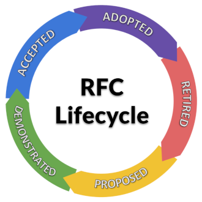

# RFCs for Enarx

This repo holds Request for Comments (RFCs), enhancement proposals to improve
the Enarx project.

Many changes, including bug fixes and documentation improvements, can be
implemented and reviewed via the
[normal GitHub pull request workflow](https://github.com/enarx/enarx/wiki/How-to-contribute).

Some changes, though, are "substantial", and we ask that these be put through a
bit of a design process and produce a consensus among the community and
the sub-teams.

If you are here to learn about Enarx, as the code is still young, we
recommend you look at the [code](https://github.com/enarx/enarx/) and
[wiki](https://github.com/enarx/enarx/wiki) in the
[main Enarx repo](https://github.com/enarx/enarx/).

In the future, you will be able to browse [the RFC Index](index.md) for
a current listing of all RFCs and their statuses.

There are 2 types of Enarx RFCs:

* RFCs that describe individual features (in the [features](./features) folder)
* RFCs that explain concepts underpinning many features
(in the [concepts](./concepts) folder)

## RFC Lifecycle

RFCs go through a standard lifecycle.

#### PROPOSED
To __propose__ an RFC, [use these instructions to raise a PR](contributing.md#how-to-propose-an-RFC)
 (Pull Request) against the repo.
Proposed RFCs are considered a "work in progress", even after they are merged.
In other words, they haven't been endorsed by the community yet, but they
seem like reasonable ideas worth exploring.

#### DEMONSTRATED
__Demonstrated__ RFCs have one or more implementations available, listed in
the "Implementations" section of the RFC document. As with the PROPOSED status,
demonstrated RFCs haven't been endorsed by the community, but the ideas put
forth have been more thoroughly explored through the implementation(s).
The demonstrated status is an __optional__ step in the lifecycle.

#### ACCEPTED
To get an RFC __accepted__, [build consensus](contributing.md#how-to-get-an-RFC-accepted)
for your RFC on our [chat](https://gitter.im/enarx/community) and in community
meetings. If your RFC is a feature that's code-related, it MUST have
reasonable tests. An accepted RFC is incubating on a standards track;
the community has decided to polish it and is exploring or pursuing implementation.

#### ADOPTED
To get an RFC __adopted__, [socialise and implement it](contributing.md#how-to-get-an-rfc-adopted).
An RFC gets this status once it has significant momentum: the mental model
it advocates has begun to permeate our discourse and the Enarx code is a
representation of that. In other words, adoption is acknowledgment of 
 _de facto_ standard.

To __refine__ an RFC, propose changes to it through additional PRs.
Typically these changes are driven by experience that accumulates during or
after adoption. Minor refinements that just improve clarity can happen inline
with lightweight review. Status is still ADOPTED.

#### RETIRED
An RFC is __retired__ when it is withdrawn from community consideration by
its authors, when implementation seems permanently stalled, or when
significant refinements require a superseding document. If a retired RFC has been
superseded, its `Superseded By` field should contain a link to the newer spec,
and the newer spec's `Supersedes` field should contain a link to the older spec.
Permalinks are not broken.

### Changing an RFC Status

See notes about this in [Contributing](contributing.md#changing-an-rfc-status).

## About

#### License

This repository is licensed under an [Apache 2.0 License](LICENSE). 

For more instructions about contributing, see [Contributing](contributing.md).

#### Acknowledgement

The structure and a lot of the initial language of this repository was borrowed from the Hyperledger [Aries RFCs](
https://github.com/hyperledger/aries-rfc), which borrowed it from [Rust RFC](https://github.com/rust-lang/rfcs).
Their good work has made the setup of this repository much quicker and better than it otherwise would have been.
Many thanks to both these communities.
